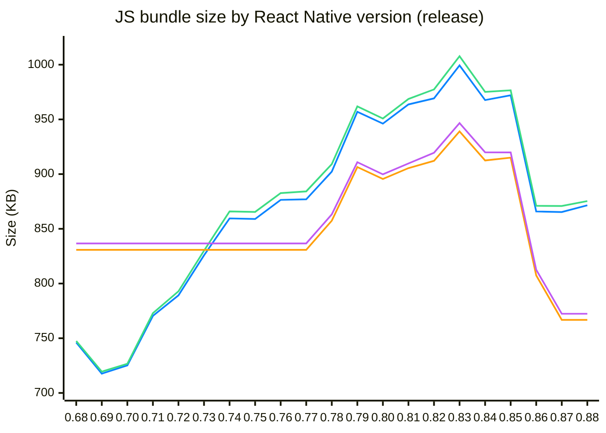

# React Native Bundle Diffs

How much does the JS bundle of a **brand-new React Native app** grow from one RN version to the next, and what changed inside it?

This repo creates an empty app from the official template for every React Native version, builds a release JS bundle for iOS and Android, and publishes a module-by-module diff between consecutive versions. Bundles are built with **Metro** (the default bundler) and **Re.Pack** (Rspack).

> [!TIP]
> Every number and report here was generated with **[react-native-bundle-discovery](https://github.com/retyui/react-native-bundle-discovery)**, a tool for exploring React Native bundle size: heavy packages, module structure and diffs between builds. It works with Metro and Re.Pack. Try it on your own app.

## Results

### Metro

Release JS bundle size (`--dev false`) of a new app, per platform:

🔵 Metro `ios` · 🟢 Metro `android` · 🟠 Re.Pack `ios` · 🟣 Re.Pack `android`

Re.Pack is measured on `0.77.x` – `0.87.x` only; outside that range its lines repeat the nearest measured value.

| Bundler | Platform | First | Last | Overall Δ | Peak |
| --- | --- | ---: | ---: | ---: | ---: |
| Metro | `ios` | 746.14 KB (`0.68.x`) | 871.52 KB (`0.88.x`) | 📈 +125.38 KB (+16.8%) | 999.33 KB (`0.83.x`) |
| Metro | `android` | 747.52 KB (`0.68.x`) | 875.36 KB (`0.88.x`) | 📈 +127.84 KB (+17.1%) | 1007.72 KB (`0.83.x`) |
| Re.Pack | `ios` | 830.81 KB (`0.77.x`) | 766.79 KB (`0.87.x`) | 📉 -64.02 KB (-7.71%) | 939 KB (`0.83.x`) |
| Re.Pack | `android` | 836.66 KB (`0.77.x`) | 772.36 KB (`0.87.x`) | 📉 -64.3 KB (-7.69%) | 946.61 KB (`0.83.x`) |

### Reports

Size change between consecutive versions. Each link opens the full report: size change, added and removed modules, and package version bumps. Re.Pack is only measured on `0.77.x` – `0.87.x` (see [Supported versions](#supported-versions)).

| From → To | Metro iOS | Metro Android | Re.Pack iOS | Re.Pack Android |
| --- | --- | --- | --- | --- |
| `0.68.x` → `0.69.x` | [📉 -28.5 KB (-3.82%)](./reports/metro/RN68-RN69-ios.md) | [📉 -28.03 KB (-3.75%)](./reports/metro/RN68-RN69-android.md) | — | — |
| `0.69.x` → `0.70.x` | [📈 +7.49 KB (+1.04%)](./reports/metro/RN69-RN70-ios.md) | [📈 +7.17 KB (+1%)](./reports/metro/RN69-RN70-android.md) | — | — |
| `0.70.x` → `0.71.x` | [📈 +45.27 KB (+6.24%)](./reports/metro/RN70-RN71-ios.md) | [📈 +46.26 KB (+6.37%)](./reports/metro/RN70-RN71-android.md) | — | — |
| `0.71.x` → `0.72.x` | [📈 +18.8 KB (+2.44%)](./reports/metro/RN71-RN72-ios.md) | [📈 +19.99 KB (+2.59%)](./reports/metro/RN71-RN72-android.md) | — | — |
| `0.72.x` → `0.73.x` | [📈 +36.59 KB (+4.64%)](./reports/metro/RN72-RN73-ios.md) | [📈 +37.09 KB (+4.68%)](./reports/metro/RN72-RN73-android.md) | — | — |
| `0.73.x` → `0.74.x` | [📈 +33.72 KB (+4.08%)](./reports/metro/RN73-RN74-ios.md) | [📈 +35.91 KB (+4.33%)](./reports/metro/RN73-RN74-android.md) | — | — |
| `0.74.x` → `0.75.x` | [📉 -559 Bytes (-0.06%)](./reports/metro/RN74-RN75-ios.md) | [📉 -495 Bytes (-0.06%)](./reports/metro/RN74-RN75-android.md) | — | — |
| `0.75.x` → `0.76.x` | [📈 +17.47 KB (+2.03%)](./reports/metro/RN75-RN76-ios.md) | [📈 +17.21 KB (+1.99%)](./reports/metro/RN75-RN76-android.md) | — | — |
| `0.76.x` → `0.77.x` | [📈 +553 Bytes (+0.06%)](./reports/metro/RN76-RN77-ios.md) | [📈 +1.58 KB (+0.18%)](./reports/metro/RN76-RN77-android.md) | — | — |
| `0.77.x` → `0.78.x` | [📈 +25.29 KB (+2.88%)](./reports/metro/RN77-RN78-ios.md) | [📈 +24.92 KB (+2.82%)](./reports/metro/RN77-RN78-android.md) | [📈 +26.6 KB (+3.2%)](./reports/repack/RN77-RN78-ios.md) | [📈 +26.52 KB (+3.17%)](./reports/repack/RN77-RN78-android.md) |
| `0.78.x` → `0.79.x` | [📈 +54.71 KB (+6.06%)](./reports/metro/RN78-RN79-ios.md) | [📈 +52.74 KB (+5.8%)](./reports/metro/RN78-RN79-android.md) | [📈 +49.03 KB (+5.72%)](./reports/repack/RN78-RN79-ios.md) | [📈 +47.7 KB (+5.53%)](./reports/repack/RN78-RN79-android.md) |
| `0.79.x` → `0.80.x` | [📉 -10.85 KB (-1.13%)](./reports/metro/RN79-RN80-ios.md) | [📉 -11.05 KB (-1.15%)](./reports/metro/RN79-RN80-android.md) | [📉 -10.85 KB (-1.2%)](./reports/repack/RN79-RN80-ios.md) | [📉 -11.12 KB (-1.22%)](./reports/repack/RN79-RN80-android.md) |
| `0.80.x` → `0.81.x` | [📈 +17.53 KB (+1.85%)](./reports/metro/RN80-RN81-ios.md) | [📈 +17.84 KB (+1.88%)](./reports/metro/RN80-RN81-android.md) | [📈 +9.86 KB (+1.1%)](./reports/repack/RN80-RN81-ios.md) | [📈 +9.96 KB (+1.11%)](./reports/repack/RN80-RN81-android.md) |
| `0.81.x` → `0.82.x` | [📈 +5.54 KB (+0.57%)](./reports/metro/RN81-RN82-ios.md) | [📈 +8.74 KB (+0.9%)](./reports/metro/RN81-RN82-android.md) | [📈 +6.66 KB (+0.74%)](./reports/repack/RN81-RN82-ios.md) | [📈 +9.81 KB (+1.08%)](./reports/repack/RN81-RN82-android.md) |
| `0.82.x` → `0.83.x` | [📈 +30.13 KB (+3.11%)](./reports/metro/RN82-RN83-ios.md) | [📈 +30.32 KB (+3.1%)](./reports/metro/RN82-RN83-android.md) | [📈 +26.89 KB (+2.95%)](./reports/repack/RN82-RN83-ios.md) | [📈 +27.08 KB (+2.94%)](./reports/repack/RN82-RN83-android.md) |
| `0.83.x` → `0.84.x` | [📉 -31.66 KB (-3.17%)](./reports/metro/RN83-RN84-ios.md) | [📉 -32.57 KB (-3.23%)](./reports/metro/RN83-RN84-android.md) | [📉 -26.53 KB (-2.83%)](./reports/repack/RN83-RN84-ios.md) | [📉 -26.72 KB (-2.82%)](./reports/repack/RN83-RN84-android.md) |
| `0.84.x` → `0.85.x` | [📈 +4.37 KB (+0.45%)](./reports/metro/RN84-RN85-ios.md) | [📈 +1.44 KB (+0.15%)](./reports/metro/RN84-RN85-android.md) | [📈 +2.58 KB (+0.28%)](./reports/repack/RN84-RN85-ios.md) | [📉 -38 Bytes (0%)](./reports/repack/RN84-RN85-android.md) |
| `0.85.x` → `0.86.x` | [📉 -106.18 KB (-10.92%)](./reports/metro/RN85-RN86-ios.md) | [📉 -105.56 KB (-10.81%)](./reports/metro/RN85-RN86-android.md) | [📉 -107.59 KB (-11.76%)](./reports/repack/RN85-RN86-ios.md) | [📉 -107.23 KB (-11.66%)](./reports/repack/RN85-RN86-android.md) |
| `0.86.x` → `0.87.x` | [📉 -552 Bytes (-0.06%)](./reports/metro/RN86-RN87-ios.md) | [📉 -204 Bytes (-0.02%)](./reports/metro/RN86-RN87-android.md) | [📉 -40.67 KB (-5.04%)](./reports/repack/RN86-RN87-ios.md) | [📉 -40.26 KB (-4.95%)](./reports/repack/RN86-RN87-android.md) |
| `0.87.x` → `0.88.x` | [📈 +6.2 KB (+0.72%)](./reports/metro/RN87-RN88-ios.md) | [📈 +4.53 KB (+0.52%)](./reports/metro/RN87-RN88-android.md) | — | — |

## Supported versions

| Bundler | React Native versions | Notes |
| --- | --- | --- |
| Metro | `0.68.x` – `0.88.x` | Every version in `rn-versions.json` |
| Re.Pack | `0.77.x` – `0.87.x` | Re.Pack's [minimum is 0.77](https://re-pack.dev/docs/getting-started/quick-start). `0.88.x` doesn't work with Re.Pack yet |

The Re.Pack range is set in [`scripts/get-versions.mjs`](./scripts/get-versions.mjs). From RN `0.79`, Re.Pack's `enablePackageExports` is turned on to match Metro's default module resolution, so the two bundlers resolve the same files.

## Adding a React Native version

1. Add an entry to [`scripts/rn-versions.json`](./scripts/rn-versions.json), e.g. `{ "id": "RN89", "version": "0.89.0" }`.
2. If the new version works with Re.Pack, raise `REPACK_MAX_MINOR` in [`scripts/get-versions.mjs`](./scripts/get-versions.mjs).
3. Build it (locally or on CI) and run `compare-reports`.
4. Update the chart, the tables and the report links in this README.
