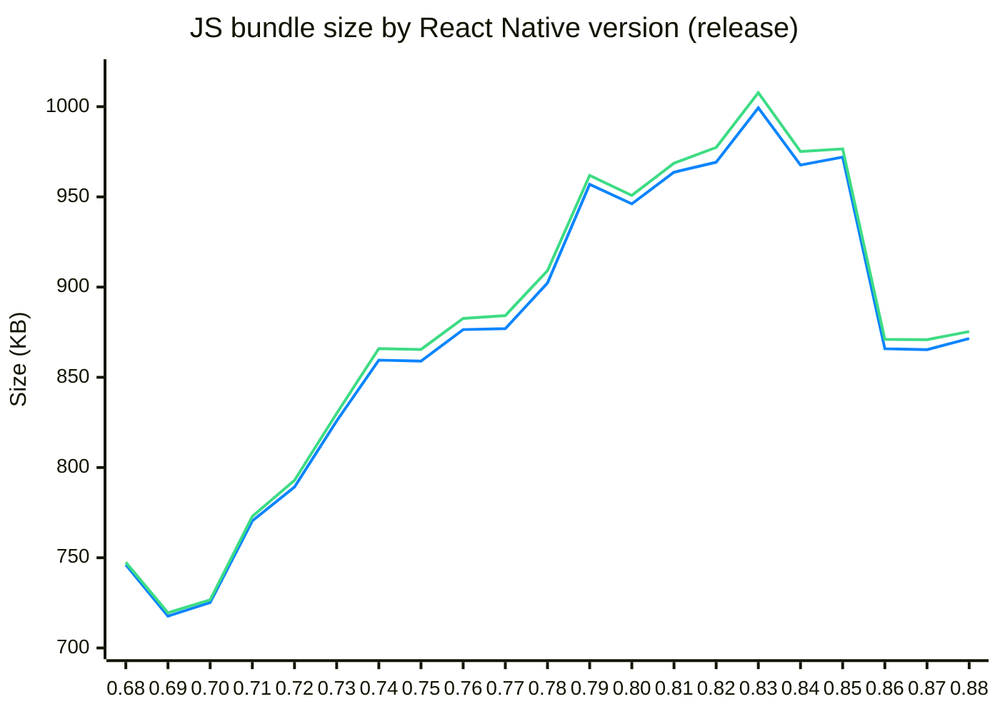

# react-native-bundle-diff

JS bundle diff (platforms: `ios`, `android`, debug: `false`):

🔵 `ios` · 🟢 `android`

| Platform | `0.68.x` | `0.88.x` | Overall Δ | Peak |
| --- | ---: | ---: | ---: | ---: |
| `ios` | 746.14 KB | 871.52 KB | 📈 +125.38 KB (+16.8%) | 999.33 KB (`0.83.x`) |
| `android` | 747.52 KB | 875.36 KB | 📈 +127.84 KB (+17.1%) | 1007.72 KB (`0.83.x`) |

## iOS

- [`0.68.x...0.69.x` 📉 -28.5 KB (-3.82%)](./reports/RN68-RN69-ios.md)
- [`0.69.x...0.70.x` 📈 +7.49 KB (+1.04%)](./reports/RN69-RN70-ios.md)
- [`0.70.x...0.71.x` 📈 +45.27 KB (+6.24%)](./reports/RN70-RN71-ios.md)
- [`0.71.x...0.72.x` 📈 +18.8 KB (+2.44%)](./reports/RN71-RN72-ios.md)
- [`0.72.x...0.73.x` 📈 +36.59 KB (+4.64%)](./reports/RN72-RN73-ios.md)
- [`0.73.x...0.74.x` 📈 +33.72 KB (+4.08%)](./reports/RN73-RN74-ios.md)
- [`0.74.x...0.75.x` 📉 -559 Bytes (-0.06%)](./reports/RN74-RN75-ios.md)
- [`0.75.x...0.76.x` 📈 +17.47 KB (+2.03%)](./reports/RN75-RN76-ios.md)
- [`0.76.x...0.77.x` 📈 +553 Bytes (+0.06%)](./reports/RN76-RN77-ios.md)
- [`0.77.x...0.78.x` 📈 +25.29 KB (+2.88%)](./reports/RN77-RN78-ios.md)
- [`0.78.x...0.79.x` 📈 +54.71 KB (+6.06%)](./reports/RN78-RN79-ios.md)
- [`0.79.x...0.80.x` 📉 -10.85 KB (-1.13%)](./reports/RN79-RN80-ios.md)
- [`0.80.x...0.81.x` 📈 +17.53 KB (+1.85%)](./reports/RN80-RN81-ios.md)
- [`0.81.x...0.82.x` 📈 +5.54 KB (+0.57%)](./reports/RN81-RN82-ios.md)
- [`0.82.x...0.83.x` 📈 +30.13 KB (+3.11%)](./reports/RN82-RN83-ios.md)
- [`0.83.x...0.84.x` 📉 -31.66 KB (-3.17%)](./reports/RN83-RN84-ios.md)
- [`0.84.x...0.85.x` 📈 +4.37 KB (+0.45%)](./reports/RN84-RN85-ios.md)
- [`0.85.x...0.86.x` 📉 -106.18 KB (-10.92%)](./reports/RN85-RN86-ios.md)
- [`0.86.x...0.87.x` 📉 -552 Bytes (-0.06%)](./reports/RN86-RN87-ios.md)
- [`0.87.x...0.88.x` 📈 +6.2 KB (+0.72%)](./reports/RN87-RN88-ios.md)

## Android

- [`0.68.x...0.69.x` 📉 -28.03 KB (-3.75%)](./reports/RN68-RN69-android.md)
- [`0.69.x...0.70.x` 📈 +7.17 KB (+1%)](./reports/RN69-RN70-android.md)
- [`0.70.x...0.71.x` 📈 +46.26 KB (+6.37%)](./reports/RN70-RN71-android.md)
- [`0.71.x...0.72.x` 📈 +19.99 KB (+2.59%)](./reports/RN71-RN72-android.md)
- [`0.72.x...0.73.x` 📈 +37.09 KB (+4.68%)](./reports/RN72-RN73-android.md)
- [`0.73.x...0.74.x` 📈 +35.91 KB (+4.33%)](./reports/RN73-RN74-android.md)
- [`0.74.x...0.75.x` 📉 -495 Bytes (-0.06%)](./reports/RN74-RN75-android.md)
- [`0.75.x...0.76.x` 📈 +17.21 KB (+1.99%)](./reports/RN75-RN76-android.md)
- [`0.76.x...0.77.x` 📈 +1.58 KB (+0.18%)](./reports/RN76-RN77-android.md)
- [`0.77.x...0.78.x` 📈 +24.92 KB (+2.82%)](./reports/RN77-RN78-android.md)
- [`0.78.x...0.79.x` 📈 +52.74 KB (+5.8%)](./reports/RN78-RN79-android.md)
- [`0.79.x...0.80.x` 📉 -11.05 KB (-1.15%)](./reports/RN79-RN80-android.md)
- [`0.80.x...0.81.x` 📈 +17.84 KB (+1.88%)](./reports/RN80-RN81-android.md)
- [`0.81.x...0.82.x` 📈 +8.74 KB (+0.9%)](./reports/RN81-RN82-android.md)
- [`0.82.x...0.83.x` 📈 +30.32 KB (+3.1%)](./reports/RN82-RN83-android.md)
- [`0.83.x...0.84.x` 📉 -32.57 KB (-3.23%)](./reports/RN83-RN84-android.md)
- [`0.84.x...0.85.x` 📈 +1.44 KB (+0.15%)](./reports/RN84-RN85-android.md)
- [`0.85.x...0.86.x` 📉 -105.56 KB (-10.81%)](./reports/RN85-RN86-android.md)
- [`0.86.x...0.87.x` 📉 -204 Bytes (-0.02%)](./reports/RN86-RN87-android.md)
- [`0.87.x...0.88.x` 📈 +4.53 KB (+0.52%)](./reports/RN87-RN88-android.md)
